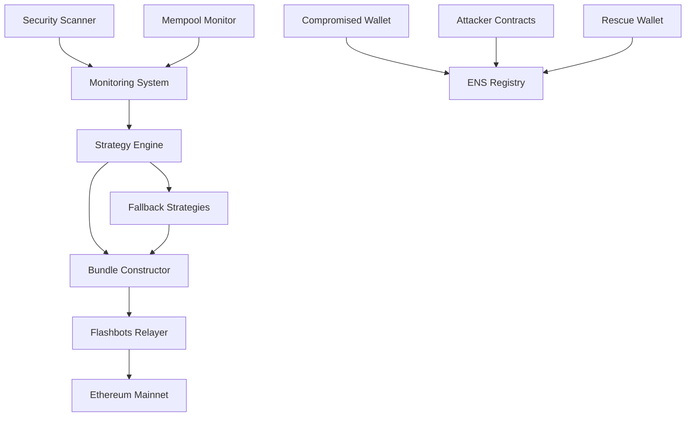

# Design Document: ENS Rescue Strategy

## Overview

This document outlines the technical design for an emergency ENS domain rescue operation to recover lukas-lat.eth from a compromised wallet. The attacker has gained control of the deployer private key and implemented delegation mechanisms to maintain control. Our strategy employs Flashbots atomic bundles to execute rescue transactions while preventing MEV attacks and front-running.

The rescue operation must be executed with extreme urgency as the attacker may attempt to transfer the domain to an address under their complete control or implement additional security measures that would make recovery impossible.

## Architecture

### High-Level Architecture



### Component Interaction Flow

1. **Monitoring System** continuously scans for attacker activity and ENS state changes
2. **Strategy Engine** selects optimal rescue approach based on current conditions
3. **Bundle Constructor** creates atomic transaction bundles for execution
4. **Flashbots Relayer** submits bundles to validators with MEV protection
5. **Fallback Strategies** activate if primary rescue attempts fail

## Components and Interfaces

### 1. ENS Domain Analyzer

**Purpose**: Analyze current state of lukas-lat.eth and identify attack vectors

**Key Functions**:
- `analyzeDomainOwnership()`: Check current owner and controller addresses
- `detectDelegationContracts()`: Identify any delegation or proxy contracts
- `scanTransactionHistory()`: Analyze recent transactions from compromised wallet
- `validateResolverSettings()`: Check for unauthorized resolver changes

**Interfaces**:
```typescript
interface ENSAnalyzer {
  analyzeDomainOwnership(domain: string): Promise<OwnershipInfo>
  detectDelegationContracts(ownerAddress: string): Promise<DelegationInfo[]>
  scanTransactionHistory(address: string, blocks: number): Promise<Transaction[]>
  validateResolverSettings(domain: string): Promise<ResolverInfo>
}

interface OwnershipInfo {
  owner: string
  controller: string
  registrant: string
  expirationDate: Date
  isCompromised: boolean
}
```

### 2. Flashbots Bundle Manager

**Purpose**: Construct and submit atomic transaction bundles for rescue operations

**Key Functions**:
- `createRescueBundle()`: Build atomic bundle with funding and transfer transactions
- `submitBundle()`: Submit bundle to Flashbots relayers with optimal timing
- `monitorBundleStatus()`: Track bundle inclusion and execution status
- `adjustGasStrategy()`: Dynamically adjust gas prices based on network conditions

**Interfaces**:
```typescript
interface BundleManager {
  createRescueBundle(strategy: RescueStrategy): Promise<Bundle>
  submitBundle(bundle: Bundle, targetBlocks: number[]): Promise<BundleResponse>
  monitorBundleStatus(bundleHash: string): Promise<BundleStatus>
  adjustGasStrategy(networkConditions: NetworkInfo): GasStrategy
}

interface Bundle {
  transactions: SignedTransaction[]
  targetBlock: number
  gasPrice: bigint
  maxFeePerGas: bigint
  maxPriorityFeePerGas: bigint
}
```

### 3. Multi-Strategy Executor

**Purpose**: Execute multiple rescue strategies simultaneously to maximize success probability

**Key Functions**:
- `executeDirectTransfer()`: Attempt direct ENS registry transferFrom
- `bypassDelegation()`: Disable or exploit delegation contracts
- `manipulateResolver()`: Change resolver before transfer
- `coordinateGasWar()`: Outbid attacker with aggressive gas pricing

**Interfaces**:
```typescript
interface StrategyExecutor {
  executeDirectTransfer(params: TransferParams): Promise<ExecutionResult>
  bypassDelegation(delegationContract: string): Promise<ExecutionResult>
  manipulateResolver(domain: string, newResolver: string): Promise<ExecutionResult>
  coordinateGasWar(competitorTx: Transaction): Promise<ExecutionResult>
}

interface RescueStrategy {
  type: 'direct' | 'delegation_bypass' | 'resolver_manipulation' | 'gas_war'
  priority: number
  gasLimit: bigint
  maxGasPrice: bigint
  timeoutBlocks: number
}
```

### 4. Real-time Monitor

**Purpose**: Provide real-time monitoring of rescue operation and attacker activity

**Key Functions**:
- `monitorMempool()`: Watch for pending transactions from compromised wallet
- `trackAttackerActivity()`: Identify new malicious contracts or transactions
- `observeBundleInclusion()`: Monitor Flashbots bundle success rates
- `detectCounterAttacks()`: Identify attacker responses to rescue attempts

**Interfaces**:
```typescript
interface RealTimeMonitor {
  monitorMempool(watchAddresses: string[]): Observable<PendingTransaction>
  trackAttackerActivity(compromisedAddress: string): Observable<AttackerAction>
  observeBundleInclusion(bundleHashes: string[]): Observable<BundleEvent>
  detectCounterAttacks(rescueTransactions: string[]): Observable<CounterAttack>
}

interface AttackerAction {
  type: 'contract_deployment' | 'delegation_change' | 'transfer_attempt' | 'resolver_change'
  transactionHash: string
  blockNumber: number
  gasPrice: bigint
  threat_level: 'low' | 'medium' | 'high' | 'critical'
}
```

## Data Models

### ENS Domain State

```typescript
interface ENSDomainState {
  domain: string
  tokenId: bigint
  owner: string
  controller: string
  registrant: string
  resolver: string
  expirationDate: Date
  delegationContracts: DelegationContract[]
  lastModified: Date
  isUnderAttack: boolean
}

interface DelegationContract {
  address: string
  type: 'proxy' | 'delegate' | 'controller'
  permissions: string[]
  deployedAt: Date
  isActive: boolean
}
```

### Rescue Operation Context

```typescript
interface RescueContext {
  compromisedWallet: string
  compromisedPrivateKey: string
  rescueWallet: string
  fundingWallet: string
  targetDomain: string
  attackerContracts: string[]
  networkConditions: NetworkConditions
  urgencyLevel: 'low' | 'medium' | 'high' | 'critical'
}

interface NetworkConditions {
  currentGasPrice: bigint
  baseFee: bigint
  priorityFee: bigint
  mempoolCongestion: number
  flashbotsSuccessRate: number
  blockTime: number
}
```

### Transaction Bundle Structure

```typescript
interface RescueBundle {
  id: string
  strategy: RescueStrategy
  transactions: BundleTransaction[]
  targetBlocks: number[]
  gasStrategy: GasStrategy
  createdAt: Date
  status: 'pending' | 'submitted' | 'included' | 'failed'
}

interface BundleTransaction {
  type: 'funding' | 'transfer' | 'delegation_bypass' | 'resolver_change'
  to: string
  data: string
  value: bigint
  gasLimit: bigint
  nonce: number
  signer: string
}
```

## Correctness Properties

*A property is a characteristic or behavior that should hold true across all valid executions of a system-essentially, a formal statement about what the system should do. Properties serve as the bridge between human-readable specifications and machine-verifiable correctness guarantees.*

### Property 1: ENS Domain Analysis Completeness
*For any* ENS domain analysis request, the system should return complete ownership information including owner, controller, and registrant addresses that are valid Ethereum addresses
**Validates: Requirements 1.1**

### Property 2: Delegation Detection Accuracy
*For any* wallet address with delegation contracts, the system should detect all active delegation mechanisms and correctly classify their types and permissions
**Validates: Requirements 1.2**

### Property 3: Transaction History Completeness
*For any* compromised wallet address and block range, the system should identify all transactions originating from that address within the specified range
**Validates: Requirements 1.3**

### Property 4: Malicious Contract Identification
*For any* contract bytecode analysis, the system should correctly identify malicious patterns and delegation mechanisms based on known attack signatures
**Validates: Requirements 1.4**

### Property 5: Resolver Configuration Validation
*For any* ENS domain resolver check, the system should detect unauthorized changes by comparing current settings against expected baseline configurations
**Validates: Requirements 1.5**

### Property 6: Bundle Construction Atomicity
*For any* rescue bundle creation, all transactions within the bundle should execute atomically or fail completely, with no partial execution states
**Validates: Requirements 2.1, 2.2, 2.3**

### Property 7: Multi-Block Submission Strategy
*For any* bundle submission request, the system should submit identical bundles to multiple consecutive future blocks to maximize inclusion probability
**Validates: Requirements 2.4**

### Property 8: Delegation Bypass Effectiveness
*For any* delegation contract encountered, the system should successfully bypass or disable the delegation mechanism before attempting ENS transfer
**Validates: Requirements 2.5, 3.2**

### Property 9: Gas Price Competition Logic
*For any* detected competitor transaction, the system should calculate gas prices that are higher than the competitor while remaining within configured maximum limits
**Validates: Requirements 3.4**

### Property 10: Strategy Coordination Timing
*For any* multi-strategy execution, all strategies should target the same block window to ensure coordinated execution
**Validates: Requirements 3.5**

### Property 11: Mempool Monitoring Completeness
*For any* monitored address, the system should detect all pending transactions in the mempool originating from that address
**Validates: Requirements 4.1**

### Property 12: Attacker Activity Pattern Recognition
*For any* transaction or contract deployment from a compromised address, the system should correctly classify the threat level based on predefined malicious patterns
**Validates: Requirements 4.2**

### Property 13: Bundle Status Monitoring and Adaptation
*For any* submitted bundle, the system should monitor its inclusion status and automatically adjust strategy parameters based on success rates
**Validates: Requirements 4.3**

### Property 14: Failure Recovery and Retry Logic
*For any* failed rescue attempt, the system should automatically retry with modified parameters within the configured retry limits
**Validates: Requirements 4.4**

### Property 15: Success Verification Completeness
*For any* rescue operation completion, the system should verify that the ENS domain ownership has been successfully transferred to the rescue wallet
**Validates: Requirements 4.5**

### Property 16: Fallback Strategy Activation
*For any* primary rescue failure, the system should activate alternative strategies using different transaction patterns and approaches
**Validates: Requirements 5.1**

### Property 17: Vulnerability Exploitation Logic
*For any* delegation contract that cannot be bypassed through normal means, the system should attempt exploitation of known vulnerabilities in the contract code
**Validates: Requirements 5.2**

### Property 18: Gas War Escalation Strategy
*For any* gas war scenario, the system should escalate gas prices beyond economically rational levels while maintaining operational budget constraints
**Validates: Requirements 5.3**

### Property 19: Multi-Relayer Coordination
*For any* timing attack failure, the system should coordinate bundle submission across multiple Flashbots relayers to increase coverage
**Validates: Requirements 5.4**

### Property 20: Manual Intervention Preparation
*For any* complete automation failure scenario, the system should provide pre-signed transactions and manual intervention options for human operators
**Validates: Requirements 5.5**

### Property 21: Private Key Security
*For any* private key handling operation, the system should never log, store, or expose private keys in any output or persistent storage
**Validates: Requirements 6.1**

### Property 22: Funding Wallet Isolation
*For any* rescue funding operation, the system should use isolated wallets with minimal balances to limit exposure in case of compromise
**Validates: Requirements 6.2**

### Property 23: Transaction Validation Completeness
*For any* transaction before signing, the system should validate all transaction parameters including recipient, amount, gas limits, and data payload
**Validates: Requirements 6.3**

### Property 24: Secure Communication Protocols
*For any* communication with Flashbots relayers, the system should use authenticated and encrypted connections with proper certificate validation
**Validates: Requirements 6.4**

### Property 25: Secure Artifact Storage
*For any* rescue operation artifacts, the system should store transaction receipts and evidence with proper encryption and access controls
**Validates: Requirements 6.5**

### Property 26: Post-Rescue Security Transfer
*For any* successful ENS rescue, the system should immediately transfer the domain to a secure multi-signature wallet within the same transaction bundle
**Validates: Requirements 7.1**

### Property 27: Resolver Security Hardening
*For any* resolver update operation, the system should only set resolvers that have been pre-approved and audited for security
**Validates: Requirements 7.2**

### Property 28: ENS Record Security Updates
*For any* ENS record configuration, the system should update all records to point exclusively to secure, controlled infrastructure addresses
**Validates: Requirements 7.3**

### Property 29: Permission Revocation Completeness
*For any* compromised wallet cleanup, the system should revoke all permissions, approvals, and access rights previously granted to the compromised address
**Validates: Requirements 7.4**

### Property 30: Incident Documentation Completeness
*For any* rescue operation, the system should generate a complete incident report including timeline, actions taken, and lessons learned for future improvements
**Validates: Requirements 7.5**

## Error Handling

### Critical Error Scenarios

1. **Bundle Inclusion Failure**: If bundles fail to be included after maximum retry attempts, escalate to manual intervention with pre-signed transactions
2. **Delegation Bypass Failure**: If delegation cannot be bypassed, attempt vulnerability exploitation or coordinate with legal/technical authorities
3. **Gas War Escalation**: If gas costs exceed operational budgets, switch to alternative strategies or seek emergency funding
4. **Relayer Communication Failure**: If Flashbots relayers are unavailable, fall back to direct mempool submission with MEV protection
5. **Private Key Compromise Detection**: If additional key compromise is detected, immediately halt operations and reassess security

### Error Recovery Strategies

- **Automatic Retry**: Failed operations retry with exponential backoff and modified parameters
- **Strategy Switching**: Failed strategies automatically trigger alternative approaches
- **Manual Escalation**: Critical failures escalate to human operators with prepared intervention options
- **Rollback Capability**: Partial operations can be rolled back if atomicity is compromised
- **Emergency Shutdown**: Complete system shutdown capability if security is compromised

### Monitoring and Alerting

- **Real-time Alerts**: Immediate notifications for critical failures or security events
- **Performance Metrics**: Continuous monitoring of bundle success rates and timing
- **Security Monitoring**: Automated detection of additional compromise or attack vectors
- **Operational Dashboards**: Real-time visibility into rescue operation status and progress

## Testing Strategy

### Dual Testing Approach

The ENS rescue system requires both unit testing and property-based testing to ensure correctness and reliability under extreme conditions:

**Unit Tests**: Verify specific rescue scenarios, edge cases, and error conditions including:
- Specific ENS domain configurations and delegation patterns
- Known attack vectors and mitigation strategies  
- Integration points between monitoring, strategy, and execution components
- Error handling for network failures and transaction rejections

**Property Tests**: Verify universal properties across all possible inputs including:
- Bundle atomicity across all transaction combinations
- Security properties for private key handling and communication
- Correctness of gas price calculations under all market conditions
- Completeness of monitoring and detection across all attack patterns

### Property-Based Testing Configuration

- **Testing Framework**: Use fast-check for TypeScript/JavaScript property-based testing
- **Test Iterations**: Minimum 1000 iterations per property test due to security criticality
- **Test Tagging**: Each property test tagged with: **Feature: ens-rescue-strategy, Property {number}: {property_text}**
- **Security Focus**: Extra emphasis on properties related to private key security and transaction validation
- **Attack Simulation**: Property tests should include adversarial inputs simulating attacker behavior

### Integration Testing

- **Testnet Simulation**: Full rescue operations tested on Ethereum testnets with simulated attacks
- **Flashbots Integration**: End-to-end testing with Flashbots testnet relayers
- **Timing Validation**: Precise timing tests to ensure bundle coordination and execution windows
- **Security Validation**: Penetration testing of all security-critical components

### Performance Testing

- **High-Frequency Monitoring**: Test system performance under continuous monitoring loads
- **Bundle Construction Speed**: Validate bundle creation times under time pressure
- **Network Resilience**: Test operation under various network conditions and congestion
- **Scalability**: Ensure system can handle multiple concurrent rescue operations