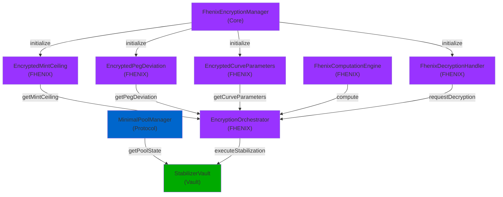

# Interaction Visualization Guide

**Version**: 1.0  
**Date**: January 8, 2026  
**Status**: Complete

## Overview

This document provides specifications for creating interactive visualizations of contract interactions, dependency graphs, and flow diagrams for the Protocol Contracts Dashboard.

---

## Visualization Types

### 1. Dependency Graph Visualization

#### Purpose
Display all contract dependencies as an interactive directed graph.

#### Components
- **Nodes**: Contracts (9 total)
- **Edges**: Dependencies (directed arrows)
- **Colors**: By category
- **Size**: By complexity

#### Node Styling

**By Category**:
- Protocol: Blue (#0066CC)
- Vault: Green (#00AA00)
- FHENIX: Purple (#9933FF)
- Oracle: Orange (#FF9900)
- Adapter: Gray (#666666)

**By Status**:
- Active: Solid
- Deprecated: Dashed
- Testing: Dotted

#### Edge Styling

**By Type**:
- Direct dependency: Solid arrow
- Optional dependency: Dashed arrow
- Critical dependency: Thick arrow (3px)

**By Frequency**:
- High frequency: Red (#FF0000)
- Medium frequency: Yellow (#FFFF00)
- Low frequency: Green (#00FF00)

#### Interactions
- **Hover**: Show contract details
- **Click**: Navigate to contract detail view
- **Drag**: Reposition nodes
- **Zoom**: Scale graph
- **Pan**: Move viewport
- **Filter**: Show/hide by category or status

#### Example Mermaid Diagram



---

### 2. Interaction Flow Diagrams

#### Purpose
Show the sequence of function calls during key operations.

#### Flow 1: Encryption Initialization

```
User/Admin
    ↓
DeployFhenixPhase1.s.sol
    ↓
FhenixEncryptionManager.initializeEncryption()
    ├→ EncryptedMintCeiling.initialize()
    ├→ EncryptedPegDeviation.initialize()
    ├→ EncryptedCurveParameters.initialize()
    └→ FhenixDecryptionHandler.initialize()
    ↓
✓ Encryption System Ready
```

#### Flow 2: Stabilization Operation

```
Uniswap V4 Hook
    ↓
StabilizerVault.stabilize()
    ├→ MinimalPoolManager.getPoolState()
    │   ↓
    │   Pool State Data
    │
    ├→ PriceFeed.getLatestPrice()
    │   ↓
    │   Price Data
    │
    └→ EncryptionOrchestrator.executeStabilization()
        ├→ EncryptedMintCeiling.getMintCeiling()
        ├→ EncryptedPegDeviation.getPegDeviation()
        ├→ EncryptedCurveParameters.getCurveParameters()
        ├→ FhenixComputationEngine.compute()
        │   ├→ add()
        │   ├→ multiply()
        │   └→ compare()
        └→ FhenixDecryptionHandler.requestDecryption()
            ↓
            ✓ Stabilization Complete
```

#### Flow 3: Decryption Request

```
EncryptionOrchestrator
    ↓
FhenixDecryptionHandler.requestDecryption()
    ├→ FhenixEncryptionManager.getPublicKey()
    ├→ Verify Authorization
    └→ Perform Decryption
        ↓
        ✓ Decrypted Data
```

---

### 3. Interaction Matrices

#### Purpose
Show all interactions in tabular format for easy reference.

#### Matrix Format

```
From\To     EM  MC  PD  CP  CE  DH  EO  SV  PM
EM          -   ✓   ✓   ✓   -   ✓   ✓   -   -
MC          -   -   -   -   -   -   ✓   -   -
PD          -   -   -   -   -   -   ✓   -   -
CP          -   -   -   -   -   -   ✓   -   -
CE          -   -   -   -   -   -   ✓   -   -
DH          -   -   -   -   -   -   ✓   -   -
EO          -   -   -   -   -   -   -   -   -
SV          -   -   -   -   -   -   ✓   -   ✓
PM          -   -   -   -   -   -   -   ✓   -

Legend: ✓ = Calls, - = No calls
```

#### Interactive Matrix Features
- **Hover**: Show function names
- **Click**: Navigate to interaction details
- **Filter**: Show/hide by category
- **Sort**: By frequency or criticality

---

### 4. Dependency Tree

#### Purpose
Show hierarchical dependencies for each contract.

#### Example: EncryptionOrchestrator

```
EncryptionOrchestrator
├── FhenixEncryptionManager
│   └── (no dependencies)
├── EncryptedMintCeiling
│   └── FhenixEncryptionManager
├── EncryptedPegDeviation
│   └── FhenixEncryptionManager
├── EncryptedCurveParameters
│   └── FhenixEncryptionManager
├── FhenixComputationEngine
│   └── (no dependencies)
└── FhenixDecryptionHandler
    └── FhenixEncryptionManager
```

#### Interactive Features
- **Expand/Collapse**: Show/hide sub-dependencies
- **Highlight**: Show all dependencies of selected contract
- **Navigate**: Click to view contract details

---

### 5. Critical Path Visualization

#### Purpose
Highlight critical interactions that could cause system failure.

#### Critical Paths

**Path 1: Encryption Initialization**
```
FhenixEncryptionManager.initializeEncryption()
    ↓ CRITICAL
EncryptedMintCeiling.initialize()
EncryptedPegDeviation.initialize()
EncryptedCurveParameters.initialize()
FhenixDecryptionHandler.initialize()
    ↓ CRITICAL
✓ System Ready
```

**Path 2: Stabilization**
```
StabilizerVault.stabilize()
    ↓ CRITICAL
EncryptionOrchestrator.executeStabilization()
    ↓ CRITICAL
FhenixComputationEngine.compute()
    ↓ CRITICAL
FhenixDecryptionHandler.requestDecryption()
    ↓ CRITICAL
✓ Stabilization Complete
```

#### Visualization Style
- **Critical edges**: Red, thick (3px)
- **Critical nodes**: Red background
- **Highlight**: Glow effect on hover

---

## Implementation Specifications

### Technology Stack

#### Frontend
- **Framework**: React
- **Visualization**: D3.js v7+
- **Graph Layout**: Dagre or ELK
- **Interaction**: React-D3-Library

#### Libraries
- `d3`: Graph visualization
- `dagre-d3`: Directed graph layout
- `react-flow-renderer`: Interactive flow diagrams
- `mermaid`: Diagram rendering

### Component Structure

```
InteractionVisualization/
├── DependencyGraph.tsx
│   ├── GraphNode.tsx
│   ├── GraphEdge.tsx
│   └── GraphLegend.tsx
├── InteractionFlow.tsx
│   ├── FlowNode.tsx
│   ├── FlowEdge.tsx
│   └── FlowLegend.tsx
├── InteractionMatrix.tsx
│   ├── MatrixCell.tsx
│   └── MatrixLegend.tsx
├── DependencyTree.tsx
│   ├── TreeNode.tsx
│   └── TreeLegend.tsx
├── CriticalPathVisualization.tsx
│   ├── CriticalNode.tsx
│   └── CriticalEdge.tsx
└── VisualizationControls.tsx
    ├── FilterControls.tsx
    ├── ZoomControls.tsx
    └── LayoutControls.tsx
```

### Data Structure

```typescript
interface InteractionVisualization {
  nodes: VisualizationNode[];
  edges: VisualizationEdge[];
  metadata: VisualizationMetadata;
}

interface VisualizationNode {
  id: string;
  label: string;
  category: ContractCategory;
  status: ContractStatus;
  position?: { x: number; y: number };
  size?: number;
  color?: string;
  isCritical?: boolean;
}

interface VisualizationEdge {
  source: string;
  target: string;
  label: string;
  type: 'dependency' | 'call' | 'critical';
  frequency: 'high' | 'medium' | 'low';
  isCritical?: boolean;
}

interface VisualizationMetadata {
  totalNodes: number;
  totalEdges: number;
  criticalPaths: number;
  lastUpdated: string;
}
```

---

## User Interactions

### Dependency Graph

| Action | Result |
|--------|--------|
| Hover on node | Show contract details tooltip |
| Click on node | Navigate to contract detail view |
| Hover on edge | Show function name and frequency |
| Click on edge | Show interaction details |
| Drag node | Reposition node |
| Scroll | Zoom in/out |
| Right-click | Show context menu |
| Double-click | Center view on node |

### Interaction Flow

| Action | Result |
|--------|--------|
| Hover on step | Show step details |
| Click on step | Navigate to contract |
| Play button | Animate flow sequence |
| Pause button | Pause animation |
| Speed slider | Adjust animation speed |
| Reset button | Return to start |

### Interaction Matrix

| Action | Result |
|--------|--------|
| Hover on cell | Show interaction details |
| Click on cell | Navigate to interaction |
| Sort by column | Sort interactions |
| Filter by row | Show only interactions from contract |
| Export | Download as CSV/JSON |

---

## Performance Optimization

### Rendering
- Use canvas rendering for large graphs (100+ nodes)
- Implement virtual scrolling for matrices
- Lazy load interaction details

### Data Loading
- Cache visualization data
- Implement incremental loading
- Use web workers for layout calculation

### Memory
- Limit node/edge count displayed
- Implement pagination for large datasets
- Clean up unused DOM elements

---

## Accessibility

### Keyboard Navigation
- Tab through nodes
- Arrow keys to navigate
- Enter to select
- Escape to deselect

### Screen Reader Support
- Descriptive labels for all elements
- ARIA attributes for interactive elements
- Text alternatives for visual elements

### Color Contrast
- WCAG AA compliant colors
- High contrast mode support
- Color-blind friendly palette

---

## Export Options

### Formats
- **SVG**: Vector format for printing
- **PNG**: Raster format for sharing
- **JSON**: Data format for analysis
- **CSV**: Tabular format for spreadsheets
- **Mermaid**: Diagram format for documentation

### Export Features
- Include legend
- Include metadata
- Customize colors
- Adjust resolution

---

## Summary

### Visualization Types: 5
- Dependency Graph
- Interaction Flow
- Interaction Matrix
- Dependency Tree
- Critical Path

### Interactive Features: 15+
- Hover, Click, Drag, Zoom, Pan
- Filter, Sort, Expand/Collapse
- Animate, Export, Print

### Performance: Optimized
- Canvas rendering for large graphs
- Virtual scrolling for matrices
- Web workers for layout

### Accessibility: WCAG AA
- Keyboard navigation
- Screen reader support
- Color contrast compliant

---

**Status**: ✅ Complete

**Last Updated**: January 8, 2026

